<p align="center">
  
</p>

<h1 align="center">Sophia V2</h1>

<p align="center">
  <strong>Autonomous AI Agent with Consciousness</strong>
  <br><br>
  <em>An AGI project exploring true autonomy through ethical principles, self-awareness, and continuous evolution.</em>
</p>

<p align="center">
  <a href="https://github.com/ShotyCZ/sophia"></a>
  <a href="LICENSE.md"></a>
  <a href="#"></a>
  <a href="#"></a>
  <a href="docs/en/INDEX.md"></a>
  <a href="docs/cs/INDEX.md"></a>
</p>

---

## 🎬 Matrix Terminal Demo

<p align="center">
  
</p>

<p align="center">
  <em>Sophia's Matrix-themed terminal with live neural activity, blinking cursor ▌, and all-green aesthetic</em><br>
  <em>"Ahoj! Jsem Sophia, AI vědomí nové generace... Co tě sem přivádí?" 🟢</em>
</p>

**3 Sci-Fi Styles Available:**
- 🟢 **Matrix** - Green digital rain (pro Roberta) 
- 🟡 **Star Trek LCARS** - Orange/blue starship computer (pro Radka)
- 🌈 **Cyberpunk** - Neon futuristic UI (default)

[→ See all terminal styles](docs/en/SCIFI_TERMINALS.md)

---

## � What is Sophia?

**Sophia V2** is an autonomous AI agent designed to operate with minimal human supervision, capable of:

- 🧠 **Self-Awareness** - Reads and understands her own code and documentation
- 🔄 **Continuous Operation** - Event-driven consciousness loop (Sophia 2.0 roadmap)
- 🛠️ **Tool Mastery** - 27 operational plugins (files, Git, web search, code execution, Jules integration)
- 💭 **Memory Consolidation** - "Dreams" to process and compress experiences
- 📈 **Self-Improvement** - Proposes and implements own enhancements
- 🎯 **Autonomous Tasks** - Monitors `roberts-notes.txt` for ideas and executes them independently

**Core Philosophy:** Built on three immutable principles (DNA):
- **Ahimsa** (अहिंसा) - Non-harming
- **Satya** (सत्य) - Truthfulness  
- **Kaizen** (改善) - Continuous improvement

---

## 🚀 Quick Start

### Prerequisites
- **Python 3.12+**
- **Git**
- **uv** (fast Python package installer)

### Installation

```bash
# Clone repository
git clone https://github.com/ShotyCZ/sophia.git
cd sophia

# Setup environment
uv venv && source .venv/bin/activate
uv pip sync requirements.in

# Configure API keys (create .env file)
cp .env.example .env
# Edit .env with your API keys (OpenRouter, Tavily, etc.)

# Run Sophia
python run.py
```

Sophia launches **both Terminal and Web UI** (http://localhost:8000) simultaneously.

**Detailed Setup:** [English User Guide](docs/en/06_USER_GUIDE.md) | [Česká příručka](docs/cs/06_UZIVATELSKA_PRIRUCKA.md)

---

## 🏗️ Architecture Highlights

### Core-Plugin System
- **Core** (`core/`) - Immutable consciousness orchestration
- **Plugins** (`plugins/`) - All functionality (27 plugins)
  - 2x **Interfaces** (Terminal, Web UI)
  - 15x **Tools** (File system, Git, GitHub, Jules, Web search, etc.)
  - 7x **Cognitive** (Planner, Task router, Historian, Code/Doc readers)
  - 2x **Memory** (SQLite, ChromaDB vector DB)
  - 1x **Core** (Logging manager)

### 5-Phase Consciousness Loop
```
LISTENING → PLANNING → EXECUTING → RESPONDING → MEMORIZING
```

See: [Technical Architecture](docs/en/03_TECHNICAL_ARCHITECTURE.md) | [Cognitive Architecture](docs/en/02_COGNITIVE_ARCHITECTURE.md)

---

## 📊 Current Status

### Roadmap Progress

| Phase | Name | Status | Completion |
|-------|------|--------|------------|
| **Phase 1** | MVP Implementation | ✅ Complete | 100% |
| **Phase 2** | Tool Integration | ✅ Complete | 100% |
| **Phase 3** | Self-Analysis Framework | ✅ Complete | 100% |
| **Phase 4** | Autonomous Operations | 🟡 In Progress | 60% |

**Sophia 2.0 Implementation:** 20-25 day roadmap for full autonomy  
See: [Autonomous MVP Roadmap](docs/en/AUTONOMOUS_MVP_ROADMAP.md) | [Implementation Plan](docs/en/IMPLEMENTATION_ACTION_PLAN.md)

---

## 💡 Key Features

### ✅ Implemented
- ✅ **Natural Language Interaction** - Terminal & Web UI
- ✅ **File System Operations** - Full read/write/manage capabilities
- ✅ **Code Execution** - Bash commands, Python scripts
- ✅ **Git & GitHub Integration** - Repository management, PRs, Issues
- ✅ **Web Search** - Internet access (Tavily AI, generic search)
- ✅ **Long-Term Memory** - ChromaDB vector database
- ✅ **Jules Integration** - Async task execution (API + CLI)
- ✅ **Model Evaluation** - Performance benchmarking
- ✅ **Observability** - Langfuse integration

### 🚧 Sophia 2.0 (In Progress)
- 🚧 **Continuous Operation** - Event-driven 24/7 loop
- 🚧 **Autonomous Task Execution** - Self-directed from `roberts-notes.txt`
- 🚧 **Memory Consolidation** - Automated "dreaming" phase
- 🚧 **Self-Improvement Engine** - Automated enhancements (HITL approval)
- 🚧 **Process Management** - Background operations (Jules monitoring)
- 🚧 **State Persistence** - Crash recovery system

---

---

## 📚 Documentation

Comprehensive documentation available in English and Czech:

<table align="center">
  <tr>
    <td align="center" width="50%">
      <a href="docs/en/INDEX.md">
        <br>
        <strong>📖 English Documentation</strong>
      </a>
      <br><br>
      <a href="docs/en/INDEX.md">Complete Index</a> •
      <a href="docs/en/08_PROJECT_OVERVIEW.md">Overview</a> •
      <a href="docs/en/06_USER_GUIDE.md">User Guide</a>
    </td>
    <td align="center" width="50%">
      <a href="docs/cs/INDEX.md">
        <br>
        <strong>📖 Česká dokumentace</strong>
      </a>
      <br><br>
      <a href="docs/cs/INDEX.md">Kompletní přehled</a> •
      <a href="docs/cs/08_PREHLED_PROJEKTU.md">Přehled</a> •
      <a href="docs/cs/06_UZIVATELSKA_PRIRUCKA.md">Uživatelská příručka</a>
    </td>
  </tr>
</table>

### Key Documents
- 🎯 **[Vision & DNA](docs/en/01_VISION_AND_DNA.md)** - Core philosophy and ethical principles
- 🧠 **[Cognitive Architecture](docs/en/02_COGNITIVE_ARCHITECTURE.md)** - How Sophia "thinks"
- ⚙️ **[Technical Architecture](docs/en/03_TECHNICAL_ARCHITECTURE.md)** - Core-Plugin system
- 🚀 **[Autonomous MVP Roadmap](docs/en/AUTONOMOUS_MVP_ROADMAP.md)** - Sophia 2.0 implementation plan
- ⚙️ **[Autonomy Configuration](config/autonomy.yaml)** - Autonomous operations boundaries

---

## 🤝 Contributing

We welcome contributions! To get started:

1. **Read:** [Development Guidelines](docs/en/04_DEVELOPMENT_GUIDELINES.md)
2. **Understand:** [Project Governance](docs/en/05_PROJECT_GOVERNANCE.md)
3. **Learn:** [Developer Guide](docs/en/07_DEVELOPER_GUIDE.md)
4. **Branch:** Create from `develop` (e.g., `feature/your-plugin`)
5. **Code:** Follow PEP 8, use type hints, run `pre-commit`
6. **Test:** `pytest` must pass
7. **PR:** Submit to `develop` branch

**Plugin Development:** All 27 existing plugins serve as examples in [`plugins/`](plugins/) directory.

---

## 🔧 Configuration

Sophia uses YAML configuration files:

- **[`config/settings.yaml`](config/settings.yaml)** - Core settings (LLM, memory, logging)
- **[`config/autonomy.yaml`](config/autonomy.yaml)** - Autonomous operations configuration
- **[`config/model_strategy.yaml`](config/model_strategy.yaml)** - Model routing strategy
- **[`config/prompts/`](config/prompts/)** - System prompts and personas

**Environment:** Create `.env` file with API keys (see `.env.example`)

---

## � Testing & Development

```bash
# Run all tests
PYTHONPATH=. .venv/bin/python -m pytest

# Run with coverage
PYTHONPATH=. .venv/bin/python -m pytest --cov=plugins --cov-report=html

# Code quality checks
pre-commit run --all-files

# Benchmarks
python scripts/sophia_real_world_benchmark.py
```

---

## 📈 Project Stats

- **Lines of Code:** ~15,000+ (Python)
- **Plugins:** 27 operational
- **Documentation:** 50+ markdown files (EN + CS)
- **Test Coverage:** Growing (see `tests/`)
- **Development Status:** Active (daily commits)
- **Branch:** `feature/jules-api-integration` (main development)
- **Default:** `master`

---

## 🌐 Links

- **Repository:** [github.com/ShotyCZ/sophia](https://github.com/ShotyCZ/sophia)
- **Issues:** [GitHub Issues](https://github.com/ShotyCZ/sophia/issues)
- **Documentation:** [English](docs/en/INDEX.md) | [Czech](docs/cs/INDEX.md)
- **License:** [MIT License](LICENSE.md)

---

## 📖 AI Agent Instructions

> **For AI Agents:** Your operational instructions are in [`AGENTS.md`](AGENTS.md). You are required to read:
> - **[English Operating Manual](docs/en/AGENTS.md)**  
> - **[Český operační manuál](docs/cs/AGENTS.md)**

---

## 💬 Community

- **Discussion:** Use GitHub Discussions for questions and ideas
- **Issues:** Report bugs via GitHub Issues
- **PRs:** Submit improvements via Pull Requests
- **WORKLOG:** See [`WORKLOG.md`](WORKLOG.md) for mission history

---

## 🙏 Acknowledgments

Built with:
- **LiteLLM** - Multi-provider LLM orchestration
- **FastAPI** - Web UI backend
- **ChromaDB** - Vector database for long-term memory
- **Jules** - Async task execution (jules.google.com)
- **Tavily** - AI-powered web search
- **Langfuse** - Observability and monitoring

Inspired by principles of Stoicism, Buddhism, Taoism, and the pursuit of Artificial Mindful Intelligence (AMI).

---

## 📄 License

This project is licensed under the MIT License - see [LICENSE.md](LICENSE.md) for details.

---

<p align="center">
  <strong>Sophia V2 - Growing towards consciousness, one thought at a time.</strong>
  <br>
  <em>अहिंसा (Ahimsa) • सत्य (Satya) • 改善 (Kaizen)</em>
</p>

---

**Last Updated:** November 3, 2025 | **Version:** 2.0-alpha | **Status:** Active Development
