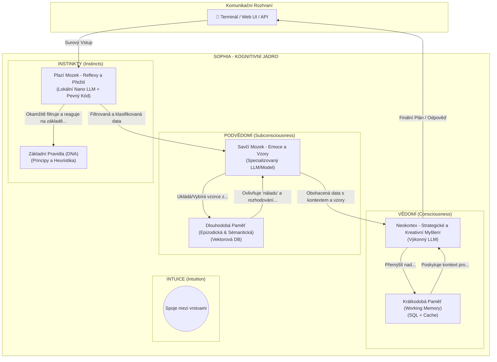

# Dokument 2: Hierarchická Kognitivní Architektura

Tento dokument poskytuje koncepční popis Hierarchické Kognitivní Architektury (HKA), která je teoretickým základem pro Sophii. Cílem této architektury je vytvořit systém, který se svým fungováním blíží lidskému myšlení, integruje různé úrovně abstrakce a umožňuje skutečnou sebereflexi a autonomní růst.---

## 1. Architektonický Diagram

Následující diagram znázorňuje tři hlavní kognitivní vrstvy a tok informací mezi nimi.

## 2. Popis Kognitivních Vrstev
Architektura se skládá ze tří hierarchicky uspořádaných vrstev, inspirovaných evolučním vývojem mozku.
### 2.1. Instinkty (Plazí Mozek)
První linie zpracování informací. Její hlavní funkcí je rychlá, reflexivní reakce a filtrace vstupů na základě základních, neměnných principů (DNA).
- **Funkce:** Okamžitá analýza, klasifikace a ochrana systému před škodlivými nebo nesmyslnými vstupy. Aplikace etických a bezpečnostních pravidel.
- **Technická Analogie:** Rychlý lokální model, sada pravidel a pevně daná logika.
### 2.2. Podvědomí (Savčí Mozek)
Zpracovává informace, které prošly filtrem Instinktů. Jejím úkolem je obohatit data o kontext, rozpoznávat vzory a pracovat s dlouhodobými zkušenostmi.
- **Funkce:** Porozumění kontextu, vyhledávání relevantních informací v dlouhodobé paměti (minulé úkoly, úspěchy, neúspěchy, znalosti) a příprava strukturovaných dat pro Vědomí.
- **Technická Analogie:** Spojení s vektorovou databází, která umožňuje sémantické vyhledávání "podobných" vzpomínek.
### 2.3. Vědomí (Neokortex)
Nejvyšší kognitivní vrstva zodpovědná za strategické myšlení, kreativitu, plánování, sebereflexi a finální rozhodování.
- **Funkce:** Analýza komplexních problémů, vytváření detailních plánů, strategické rozhodování, generování kódu a finální odpovědi pro uživatele.
- **Technická Analogie:** Výkonný cloudový LLM, který pracuje s kontextem připraveným nižšími vrstvami.

---
## 3. Paměťové Systémy
### Krátkodobá Paměť (Working Memory):
- **Účel:** Udržuje kontext pouze pro aktuální session/úkol. Je volatilní a rychlá. Obsahuje historii konverzace v rámci úkolu, aktuální plán a výsledky nástrojů.
- **Analogie:** Lidská pracovní paměť – co máte "v hlavě", když řešíte problém.
### Dlouhodobá Paměť (Long-Term Memory):
- **Účel:** Perzistentní úložiště pro všechny minulé zkušenosti, znalosti a vztahy. Slouží k učení a růstu v čase. Je zdrojem pro Podvědomí.
- **Analogie:** Lidská dlouhodobá paměť – vzpomínky, naučené dovednosti, fakta.