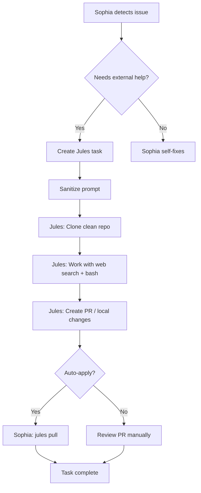

# Jules AI Agent Integration - Návod

## 🎯 Přehled

Jules je **externí AI programátor** (Google) který Sophii pomáhá s coding tasky. 

### ⚙️ Jules má přístup k:

✅ **Kompletnímu GitHub repo** (včetně všech souborů)  
✅ **Secrets nakonfigurovaným v jules.google.com** pro konkrétní repo  
✅ **Web search** (Google, Stack Overflow, dokumentace)  
✅ **Bash commands** (může spouštět testy, build skripty)  
✅ **File editing** (může upravovat jakékoliv soubory v repo)  
✅ **Git operations** (vytváří branches, commity, PRs)

### 🔑 Konfigurace Secrets v Jules UI

1. Otevři https://jules.google.com
2. Vyber repo (např. `ShotyCZ/sophia`)
3. Settings → Secrets
4. Přidej:
   - `OPENROUTER_API_KEY`
   - `TAVILY_API_KEY`
   - `JULES_API_KEY` (pokud chceš aby Jules sám sebe volal)
   - Jakékoliv další secrets

**Jules pak má přístup k těmto secrets** stejně jako by je měl v `.env`!

## 📋 Jak Jules funguje

### 1. **Sophia deleguje task**
```python
await jules_autonomy.delegate_task(
    context=context,
    repo="ShotyCZ/sophia",
    task="Fix benchmark_runner.py to work without .env variables",
    auto_apply=True
)
```

### 2. **Jules si stáhne čistý GitHub repo**
- Vytvoří vlastní working branch
- **NEMÁ** access k `.env`, `.data/`, local files
- Používá pouze to co je commitnuto na GitHubu

### 3. **Jules má k dispozici nástroje:**
- ✅ **Web Search** - může googlovat dokumentaci, Stack Overflow
- ✅ **Bash commands** - může spustit testy, build skripty
- ✅ **File editing** - může upravovat soubory v repo
- ✅ **Git operations** - vytváří branches, commity
- ❌ **Sophiiny credentials** - NEMÁ přístup k API keys
- ❌ **Runtime state** - NEMÁ přístup k databázím, logům

### 4. **Výsledek**
- Jules vytvoří **Pull Request** nebo
- Sophia lokálně aplikuje změny přes `jules pull`

## ✅ Správné použití Jules

### Příklad 1: Unit test
```python
task = """
Create unit tests for plugins/cognitive_planner.py.

Test cases:
1. Valid JSON array parsing
2. Single object wrapping
3. Invalid JSON handling

Use pytest framework. Save to tests/test_cognitive_planner.py.
"""
```

✅ **Proč funguje:**
- Jasné zadání
- Žádné reference na .env
- Všechny potřebné soubory jsou na GitHubu

### Příklad 2: Fix dokumentace
```python
task = """
Update docs/ARCHITECTURE.md to include event-driven loop section.

Add:
- EventDrivenLoop class overview
- PROACTIVE_HEARTBEAT event description
- Plugin subscription example

Reference: core/event_loop.py
"""
```

✅ **Proč funguje:**
- Specifické soubory
- Veřejně dostupný kód
- Jasný outcome

## ❌ Špatné použití Jules

### Chyba 1: Reference na .env
```python
task = "Fix benchmark runner that uses .env variables"
```

❌ **Proč nefunguje:**
- Jules NEMÁ `.env` soubor
- Neví jaké proměnné tam jsou
- Nemůže testovat

### Opravené:
```python
task = """
Fix benchmark_runner.py to work without environment variables.

Changes needed:
1. Remove direct .env dependencies
2. Use mock configuration for tests
3. Add config parameter to __init__()

Example:
```python
class BenchmarkRunner:
    def __init__(self, config=None):
        self.config = config or {"offline_mode": True}
```

DON'T modify .env files - they're not in the repo.
"""
```

### Chyba 2: Vágní instrukce
```python
task = "Improve Sophia's performance"
```

❌ **Proč nefunguje:**
- Není jasné CO zlepšit
- Jules nemá metriky
- Neví jaký je aktuální stav

### Opravené:
```python
task = """
Optimize cognitive_planner.py LLM retry logic.

Current issue:
- Retries 4 times even for valid responses
- Wastes API calls

Solution:
- Add early exit when valid JSON is found
- Only retry on actual parsing errors
- Add debug logging for each retry

File: plugins/cognitive_planner.py
Lines: ~360-520
"""
```

## 🔧 Sanitizace promptů

Sophia **automaticky čistí** prompty před odesláním Julesovi:

```python
def _sanitize_prompt_for_jules(sophia_task: str) -> str:
    """
    Removes:
    - .env references → warning + instructions
    - "Sophia's" → "the project's"
    - Internal jargon
    
    Adds:
    - "Work with clean GitHub repo"
    - "Use mock values for config"
    - "Don't modify .env"
    """
```

### Příklad sanitizace:

**Před:**
```
Fix Sophia's benchmark that uses .env API keys
```

**Po:**
```
Task for Jules AI Agent (working with clean GitHub repo):

Fix the project's benchmark that uses .env API keys

IMPORTANT: Work with clean GitHub repo (no .env or internal data).
Use mock/example values for any configuration.
Don't create or modify .env files.
```

## 📊 Best Practices

### ✅ Dobré tasky pro Julese:
1. **Unit testy** - má všechen kód na GitHubu
2. **Dokumentace** - může číst source code
3. **Refactoring** - jasné soubory, jasný cíl
4. **Bug fixy** - s reprodukčním kroky
5. **Features** - s přesnými specs

### ❌ Špatné tasky pro Julese:
1. **Debug runtime issues** - nemá logy, databáze
2. **Config změny** - nemá .env, settings
3. **Deployment** - nemá credentials
4. **Monitoring fixes** - nemá runtime state
5. **Vague improvements** - není jasný cíl

## 🔄 Workflow



## 📝 Checklist před odesláním Julesovi

- [ ] Task má **jasné zadání** (ne "improve X")
- [ ] Všechny **referenced soubory jsou na GitHubu**
- [ ] **Žádné .env/secrets** reference
- [ ] **Jasný outcome** (co má být výsledek)
- [ ] **Testovatelné** (Jules může ověřit že funguje)
- [ ] **Specifické soubory** (ne "celý codebase")

## 🆘 Troubleshooting

### Jules vrací nesmyslný kód
**Příčina:** Vágní prompt nebo chybějící kontext

**Řešení:**
```python
# Místo:
task = "Fix auth"

# Použij:
task = """
Fix authentication in plugins/tool_llm.py line 156.

Issue: Missing API key validation
Fix: Add check before API call:
  if not self.api_key:
      raise AuthError("API key not configured")

Test: Run test_tool_llm.py::test_missing_api_key
"""
```

### Jules nemůže najít soubor
**Příčina:** Soubor není commitnutý na GitHubu (např. `.env`, `.data/`)

**Řešení:** Použij mock data nebo přesuň konfiguraci do kódu:
```python
# Místo .env
CONFIG = {
    "offline_mode": True,
    "local_llm_url": "http://localhost:11434"
}
```

### Jules timeout
**Příčina:** Task je moc složitý

**Řešení:** Rozděl na menší kroky:
```python
# Místo jednoho velkého:
task = "Refactor entire cognitive system"

# Udělej série malých:
tasks = [
    "Refactor cognitive_planner.py - extract JSON parsing",
    "Refactor cognitive_task_router.py - simplify budget logic",
    "Add unit tests for both modules"
]
```

## 🔗 Related Docs

- `plugins/tool_jules.py` - Jules API wrapper
- `plugins/tool_jules_cli.py` - Jules CLI wrapper
- `plugins/cognitive_jules_autonomy.py` - High-level workflows
- `plugins/cognitive_jules_monitor.py` - Session monitoring

---

**TL;DR:** Jules = externí programátor s čistým GitHub repo. Dávej mu **jasné zadání bez .env references**!
