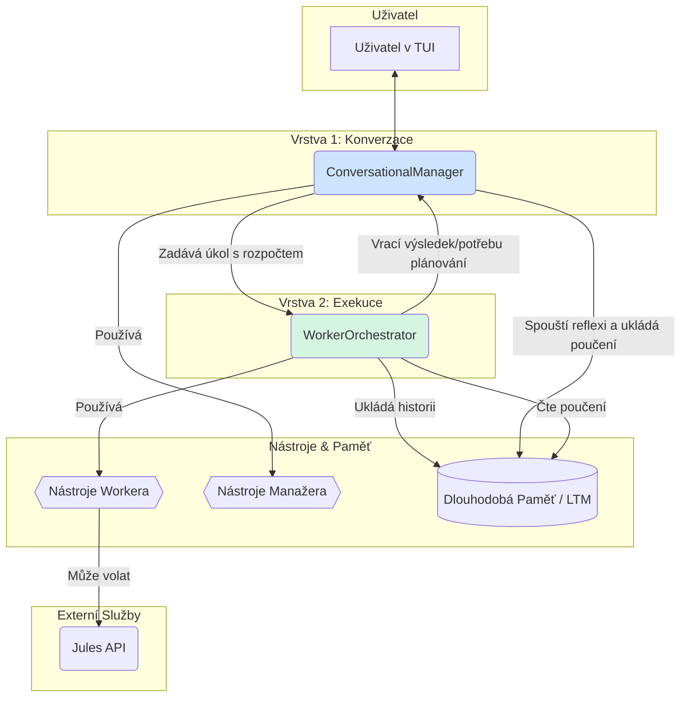

# Vize a Architektura MVP: Projekt "Probuzený Nomád"

Tento dokument definuje finální vizi a technickou architekturu pro dosažení Minimálního Životaschopného Produktu (MVP) agenta Nomáda. Cílem MVP je vytvořit AI softwarového inženýra, který je schopen plně autonomní sebereflexe a sebezdokonalování.

## 1. Vize MVP: "Agent, který se sám vyvíjí"

Finálním testem a demonstrací schopností Nomáda bude úspěšné zvládnutí následujícího úkolu zadaného v přirozeném jazyce:

> **"Nomáde, prostuduj koncept 'Sophie' jako etického a sebereflektivního jádra. Navrhni nejlepší způsob, jak tento koncept integrovat do své vlastní architektury, a poté tuto integraci proveď."**

Nomád v MVP stavu musí být schopen tento komplexní úkol autonomně naplánovat, delegovat části práce, implementovat změny, otestovat je a úspěšně je začlenit do svého vlastního fungování.

## 2. Klíčové Principy Architektury

Architektura je navržena s ohledem na 5 klíčových principů:

1.  **Oddělení Zodpovědností (Separation of Concerns):** Komunikace s uživatelem je striktně oddělena od exekuce úkolů.
2.  **Adaptivní Řízení Složitosti (Adaptive Complexity Management):** Agent dynamicky volí mezi jednoduchou exekucí a formálním plánováním.
3.  **Neustálé Učení (Continuous Learning):** Agent se aktivně učí ze svých úspěchů i neúspěchů.
4.  **Bezpečná Autonomie (Safe Autonomy):** Komplexní nebo rizikové operace jsou delegovány a podléhají schválení.
5.  **Transparentnost (Transparency):** Všechny akce a myšlenkové pochody agenta jsou pozorovatelné.

## 3. "Dokonalá" Technická Architektura

Navrhovaná architektura se skládá ze dvou hlavních vrstev a několika podpůrných systémů, které spolupracují v uzavřeném cyklu.

### Popis Komponent:

*   **`ConversationalManager` (Manažer):**
    *   **Role:** Inteligentní rozhraní pro uživatele. Vede dialog, chápe kontext.
    *   **Prompt:** `manager_prompt.txt` (definuje jeho omezení).
    *   **Nástroje:** Pouze "read-only" nástroje pro zjištění stavu (`get_worker_status` atd.) z profilu `manager`.
    *   **Klíčová Logika:**
        1.  Přijme úkol od uživatele.
        2.  Zeptá se Workera, zda je úkol proveditelný v rámci "rozpočtu na složitost".
        3.  Pokud ano, čeká na výsledek.
        4.  Pokud ne, zeptá se uživatele na povolení k plánování.
        5.  Po dokončení úkolu spustí cyklus sebereflexe.
        6.  Pomocí LLM a `final_response_prompt.txt` zformuluje finální odpověď pro uživatele.

*   **`WorkerOrchestrator` (Worker):**
    *   **Role:** "Motor" systému. Provádí skutečnou práci.
    *   **Prompt:** `system_prompt.txt` (obsahuje Zlatá pravidla a poučení z LTM).
    *   **Nástroje:** Všechny exekuční nástroje (práce se soubory, git, volání Jules API) z profilu `worker`.
    *   **Klíčová Logika:**
        1.  Přijme úkol a "rozpočet" od Manažera.
        2.  Snaží se úkol splnit v rámci rozpočtu.
        3.  Pokud narazí na složitost, vrátí stav `needs_planning`.
        4.  Pokud je schváleno plánování, vytvoří detailní plán a provede ho.
        5.  Vrací strukturovaný výsledek o úspěchu/neúspěchu.

*   **Dlouhodobá Paměť (LTM):**
    *   Obsahuje dva typy záznamů: `{"type": "history"}` a `{"type": "learning"}`.
    *   Worker čte "poučení" (`learning`), aby optimalizoval svůj postup.
    *   Manažer zapisuje nová "poučení" po každé sebereflexi.

*   **Jules API Client:**
    *   Nástroj dostupný pro Workera.
    *   Jeho použití je podmíněno schválením od uživatele skrze Manažera (Human-in-the-Loop).

Tato architektura poskytuje robustní, flexibilní a transparentní základ pro dosažení našeho cíle – plně autonomního AI softwarového inženýra, který je schopen sebereflexe a neustálého zlepšování.