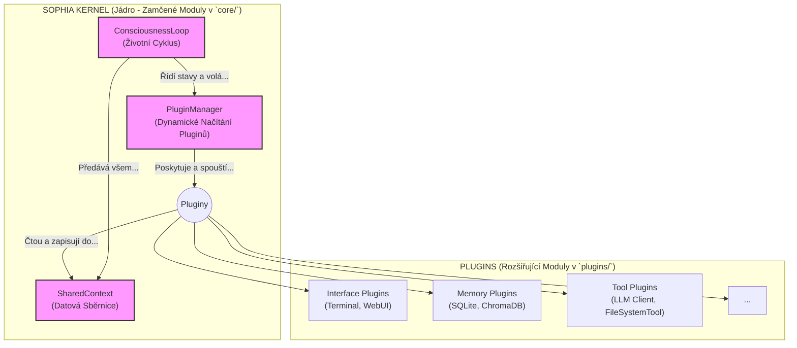

# Dokument 3: Technická Architektura (Kernel & Plugin Blueprint)

Tento dokument definuje finální, neměnnou technickou architekturu Sophie. Je navržena pro maximální stabilitu, modularitu a bezpečnou rozšiřitelnost, a to i při využití autonomních AI agentů pro vývoj.

---

## 1. Filosofie: Princip Jádra a Pluginů (Kernel & Plugin Principle)

Architektura je postavena na striktním oddělení dvou typů komponent:

*   **Jádro (Kernel):** Absolutně minimální, stabilní a **"zamčený"** kód. Jeho jedinou zodpovědností je orchestrace: spravovat životní cyklus, dynamicky načítat pluginy a bezpečně mezi nimi předávat data. Jádro samo o sobě nemá žádnou specifickou funkci – je to operační systém, nikoliv aplikace.

*   **Pluginy (Plugins):** Všechny specifické funkce systému jsou implementovány jako samostatné, izolované a vyměnitelné pluginy. Paměť, komunikace s LLM, uživatelská rozhraní, práce se soubory – to vše jsou pluginy. Aby je Jádro mohlo použít, musí dodržovat striktní rozhraní (kontrakt).

**Tento princip je klíčový pro bezpečnost a stabilitu. AI agenti nikdy neupravují Jádro. Jejich úkolem je pouze vytvářet nové pluginy.**

---

## 2. Architektonický Diagram

---

## 3. Komponenty Jádra (`core/`) - Zamčeno

Tyto komponenty tvoří stabilní a neměnné jádro.

### 3.1. `Kernel` (`core/kernel.py`)
*   **Zodpovědnost:** Hlavní orchestrátor.
    1.  **Inicializace:** Vytvoří `PluginManager` a `SharedContext`.
    2.  **Spuštění:** Spustí `ConsciousnessLoop`.
    3.  **Životní Cyklus (`ConsciousnessLoop`):** Nekonečná smyčka, která řídí stavy systému (např. `LISTENING`, `THINKING`, `ACTING`). V každém kroku se dotazuje `PluginManageru` na relevantní pluginy pro daný stav a spouští je s aktuálním `SharedContext`.

### 3.2. `PluginManager` (`core/plugin_manager.py`)
*   **Zodpovědnost:** Správa životního cyklu pluginů.
    1.  **Dynamické Načítání:** Při startu Jádra automaticky prohledá adresář `plugins/`.
    2.  Najde, validuje a inicializuje všechny platné pluginy (třídy dědící z `BasePlugin`).
    3.  Registruje pluginy podle jejich typu (např. `INTERFACE`, `MEMORY`, `TOOL`).
    4.  Poskytuje Jádru metody pro získání a spuštění pluginů.

### 3.3. `SharedContext` (`core/context.py`)
* **Zodpovědnost:** Datová sběrnice a "krevní oběh" systému.
1. Je to `dataclass`, jehož instance se předává všem pluginům v každém cyklu.
2. Obsahuje veškerý stav pro aktuální cyklus: `session_id`, `current_state`, `user_input`, `history`, flexibilní `payload` pro data mezi pluginy a **specifický logger pro danou session**.
* **Struktura (`dataclass`):**
* `session_id: str`: Unikátní ID pro aktuální sezení.
* `current_state: str`: Aktuální stav smyčky (`LISTENING`, `THINKING`, ...).
* `user_input: str | None`: Poslední vstup od uživatele.
* `history: list`: Krátkodobá historie aktuální konverzace.
* `payload: dict`: "Nákladový prostor" pro data mezi pluginy.
* `logger: logging.Logger`: Nakonfigurovaný logger, který automaticky přidává `session_id` do všech záznamů. Tím je zajištěno přehledné a kontextuální logování napříč všemi pluginy.

---

## 4. Kontrakt pro Pluginy (`plugins/`) - Rozšiřitelné

### 4.1. `BasePlugin` (`plugins/base_plugin.py`)
*   **Zodpovědnost:** Definuje **striktní kontrakt (rozhraní)**, který musí každý plugin dodržet.
*   **Struktura (Abstraktní Třída):**
    *   `name: str`: Unikátní jméno pluginu.
    *   `plugin_type: PluginType (Enum)`: Typ pluginu (`INTERFACE`, `MEMORY`, `TOOL`).
    *   `version: str`: Verze pluginu.
    *   `setup()`: Metoda volaná `PluginManagerem` při inicializaci. Slouží k nastavení (např. připojení k databázi).
    *   `execute(context: SharedContext) -> SharedContext`: Hlavní metoda, kterou volá Jádro. Plugin provede svou operaci na základě dat v `context` a vrátí upravený `context`.

#### 4.1.1. Dostupné Nástrojové Pluginy (Tool Plugins)

*   **`FileSystemTool`:** Poskytuje agentovi bezpečné, izolované prostředí (sandbox) pro čtení, zápis a výpis souborů. Všechny operace jsou omezeny na určený adresář `sandbox/`, aby se zabránilo neúmyslnému přístupu k systému.
*   **`BashTool`:** Umožňuje agentovi spouštět shellové příkazy v bezpečném, izolovaném prostředí. To je užitečné pro spouštění skriptů, správu procesů nebo kontrolovanou interakci s operačním systémem.
*   **`GitTool`:** Umožňuje agentovi interagovat s jeho vlastním repozitářem zdrojového kódu. Může kontrolovat stav, prohlížet změny (diffs) a zjišťovat název aktuální větve, což mu dává základní úroveň povědomí o vlastním kódu.

Tato architektura zajišťuje, že systém může růst a získávat nové schopnosti pouhým přidáním nových souborů do adresáře `plugins/`, aniž by bylo nutné zasahovat do jeho stabilního a chráněného jádra.