[📚 Documentation Index](INDEX.md) | [⬅️ 01 Vision & DNA](01_VISION_AND_DNA.md) | **02** → [03 Technical Architecture](03_TECHNICAL_ARCHITECTURE.md)

---

# Document 2: Hierarchical Cognitive Architecture

**How Sophia "Thinks"** | Cognitive Model | Consciousness Loop

This document provides a conceptual description of the Hierarchical Cognitive Architecture (HCA), which serves as the theoretical foundation for Sophia. The goal of this architecture is to create a system that approximates human thought processes, integrates various levels of abstraction, and enables true self-reflection and autonomous growth.

> 🧠 **Note:** This architecture is implemented in [`core/kernel.py`](../../core/kernel.py) through the **5-phase consciousness loop**: LISTENING → PLANNING → EXECUTING → RESPONDING → MEMORIZING

---

## 1. Architectural Diagram

The following diagram illustrates the three main cognitive layers and the flow of information between them.

```mermaid
graph TD
    subgraph "Communication Interface"
        UI["💬 Terminal / Web UI / API"]
    end

    subgraph "SOPHIA - COGNITIVE CORE"

        subgraph "CONSCIOUSNESS"
            direction LR
            A["Neocortex - Strategic & Creative Thought\n(High-Performance LLM)"]
            B["Short-Term Memory (Working Memory)\n(SQL + Cache)"]
            A -- "Thinks about..." --> B
            B -- "Provides context for..." --> A
        end

        subgraph "SUBCONSCIOUS"
            direction LR
            C["Mammalian Brain - Emotions & Patterns\n(Specialized LLM/Model)"]
            D["Long-Term Memory (Episodic & Semantic)\n(Vector DB)"]
            C -- "Stores/Retrieves patterns from..." --> D
            D -- "Influences 'mood' and decisions of..." --> C
        end

        subgraph "INSTINCTS"
            direction LR
            E["Reptilian Brain - Reflexes & Survival\n(Local Nano LLM + Hard Code)"]
            F["Core Rules (DNA)\n(Principles & Heuristics)"]
            E -- "Instantly filters & reacts based on..." --> F
        end

        subgraph "INTUITION"
            G((Connections Between Layers))
        end
    end

    UI -- "Raw Input" --> E
    E -- "Filtered & classified data" --> C
    C -- "Enriched data with context & patterns" --> A
    A -- "Final Plan / Response" --> UI
```

## 2. Description of Cognitive Layers

The architecture consists of three hierarchically organized layers, inspired by the evolutionary development of the brain.

### 2.1. Instincts (Reptilian Brain)
The first line of information processing. Its main function is a rapid, reflexive response and the filtering of inputs based on fundamental, immutable principles (the DNA).
- **Function:** Instantaneous analysis, classification, and protection of the system from harmful or nonsensical inputs. Application of ethical and safety rules.
- **Technical Analogy:** A fast, local model, a set of rules, and hard-coded logic.

### 2.2. Subconscious (Mammalian Brain)
Processes information that has passed through the Instincts filter. Its task is to enrich the data with context, recognize patterns, and work with long-term experiences.
- **Function:** Understanding context, searching for relevant information in long-term memory (past tasks, successes, failures, knowledge), and preparing structured data for the Consciousness.
- **Technical Analogy:** A connection to a vector database, which allows for semantic searching of "similar" memories.

### 2.3. Consciousness (Neocortex)
The highest cognitive layer responsible for strategic thinking, creativity, planning, self-reflection, and final decision-making.
- **Function:** Analysis of complex problems, creation of detailed plans, strategic decision-making, code generation, and final responses to the user.
- **Technical Analogy:** A high-performance cloud LLM that operates on the context prepared by the lower layers.

---

## 3. Memory Systems

### Short-Term Memory (Working Memory):
- **Purpose:** Maintains context only for the current session/task. It is volatile and fast. It contains the conversation history for the task, the current plan, and the results of tool use.
- **Analogy:** Human working memory—what you have "in your head" when solving a problem.

### Long-Term Memory:
- **Purpose:** A persistent store for all past experiences, knowledge, and relationships. It is used for learning and growth over time. It is the source for the Subconscious.
- **Analogy:** Human long-term memory—memories, learned skills, facts.

---

## Related Documentation

- 🎯 **[Vision & DNA](01_VISION_AND_DNA.md)** - Philosophical foundation of this architecture
- ⚙️ **[Technical Architecture](03_TECHNICAL_ARCHITECTURE.md)** - Implementation of this cognitive model
- 🧑‍💻 **[Developer Guide](07_DEVELOPER_GUIDE.md)** - How to extend cognitive capabilities
- 📋 **[Autonomous Operations Roadmap](roadmap/04_AUTONOMOUS_OPERATIONS.md)** - Evolution to event-driven consciousness

**Key Implementation Files:**
- [`core/kernel.py`](../../core/kernel.py) - Consciousness loop orchestration
- [`plugins/cognitive_*.py`](../../plugins/) - 7 cognitive plugins (planner, historian, task router, etc.)
- [`plugins/memory_*.py`](../../plugins/) - SQLite (working memory) + ChromaDB (long-term)

---

**Navigation:** [📚 Index](INDEX.md) | [🏠 Home](../../README.md) | [⬅️ Previous: Vision](01_VISION_AND_DNA.md) | [➡️ Next: Technical Architecture](03_TECHNICAL_ARCHITECTURE.md)

---

*Last Updated: November 3, 2025 | Status: ✅ Current | Implemented in Sophia 2.0*
